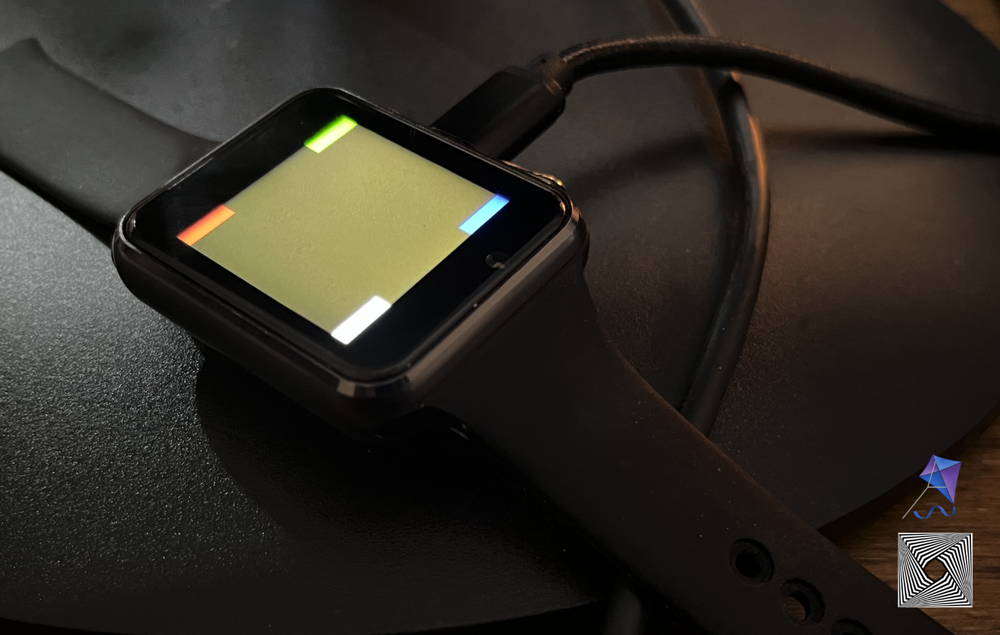

# ⌚️ T-Watch-S3 Zephyr Board Module #


> [!CAUTION]
> **Under active development. Do not use except to experiment/learn.**

> [!WARNING] 
> **By using this module, you accept all responsibility for any damage to property or person. In particular, battery management is not yet validated. I highly recommend removing the battery from your device entirely.**



Zephyr board support for the [LilyGo T-Watch S3](https://lilygo.cc/products/t-watch-s3).

## Current Status ##

The following features are currently supported and superficially tested using the `test` project:

- [x] usb uart (`hello_world.c`)
- [x] LCD display (`display.c`)
- [x] display backlight (`diplay.c`)
- [x] touch panel (`touch.c`)
- [x] basic haptics (`haptics.c`)
- [x] accelerometer (`imu.c`)
- [x] PMIC power to haptics & LCD (`power.c`)

The following features are not yet supported/tested:

- [ ] [battery management](https://github.com/vvvvvvvvvv-LLC/t-watch-s3/issues/11)
> [!WARNING] 
> **Be very careful with this, the PMIC may be misconfigured and could overcharge or over-discharge the battery. I strongly suggest removing the battery entirely until the PMIC functionality is validated.**
- [ ] [bluetooth](https://github.com/vvvvvvvvvv-LLC/t-watch-s3/issues/3)
- [ ] [wifi](https://github.com/vvvvvvvvvv-LLC/t-watch-s3/issues/2)
- [ ] [microphone](https://github.com/vvvvvvvvvv-LLC/t-watch-s3/issues/1)
> [!NOTE] 
> (PDM support over I2S is supported in the esp32 hal, but not surfaced to Zephyr)
- [ ] [speaker](https://github.com/vvvvvvvvvv-LLC/t-watch-s3/issues/4)
> [!NOTE]
> The MAX98357 driver will need to be implemented
- [ ] [LoRa radio](https://github.com/vvvvvvvvvv-LLC/t-watch-s3/issues/5)
- [ ] [LoRaWAN support](https://github.com/vvvvvvvvvv-LLC/t-watch-s3/issues/6)
> [!NOTE]
> There is some work on enabling the LoRa Basics Modem. It may be worth waiting to do this.
- [ ] [external button](https://github.com/vvvvvvvvvv-LLC/t-watch-s3/issues/7)
- [ ] [Infrared LED](https://github.com/vvvvvvvvvv-LLC/t-watch-s3/issues/8)
- [ ] [Realtime clock](https://github.com/vvvvvvvvvv-LLC/t-watch-s3/issues/9)
- [ ] [SPI Flash Storage](https://github.com/vvvvvvvvvv-LLC/t-watch-s3/issues/10)

## Getting Started ##

This is intended to be used as a [Zephyr module](https://docs.zephyrproject.org/latest/develop/modules.html).

Assuming you have `west` and a Zephyr toolchain installed, you can make use of the `t-watch-s3` board
by adding the following to a `west.yml` file in a new project:

```yaml
manifest:
  remotes:
    - name: vvvvvvvvvv-llc
      url-base: https://github.com/vvvvvvvvvv-LLC
  
  projects:
    - name: t-watch-s3
      remote: vvvvvvvvvv-llc
      repo-path: t-watch-s3
      revision: main
```

> [!NOTE] 
> a very good project to set up your basic project structure is the [zephyr example application](https://github.com/zephyrproject-rtos/example-application).

Then run `west update` to fetch the latest version of the module.

An easy way to confirm you can build is to copy the `test` directory to your project and run `west build -b t_watch_s3/esp32s3/procpu` inside that directory.


## Building ##

The module contains a *test* project used to lightly validate functionality as it is being developed.
To build the project, navigate to the `test` directory and run `west build -b t_watch_s3/esp32s3/procpu`.

You can then flash the binary using `west flash [--esp-device <serial port>]` and monitor
the output using `west espressif monitor [--port <serial port>]`.


## Contributing ##

**This module is still actively under development.**

If you would like to contribute, please do not hesitate to open a PR or an issue.
A more comprehensive contribution guide will be added in the future.

You may find the [schematic](./docs/T_WATCH_S3.pdf) useful.
